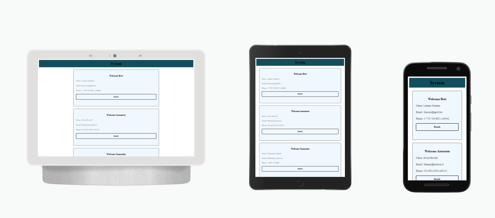

<h1 align="center">
  
</h1>

O projeto foi inicializado com o [Create React App](https://github.com/facebook/create-react-app).

Esta aplicação consiste na criação, leitura, edição, atualização e remoção
de um usuário, utilizando o [JSONPlaceholder](https://jsonplaceholder.typicode.com/)
que é uma API REST fake, usada para testes e prototipagens.

Para rodar o react-crud no modo de desenvolvimento, use o comando `npm start`.
A aplicação irá abrir no seu navegador padrão, na porta 3000 como: `http://localhost:3000` e a página irá recarregar automaticamente se você fizer mudanças no código.

O comando `npm test` executa o comando de teste.

O comando `npm build` compila o aplicativo para produção. Ele agrupa o React no modo de produção e otimiza a compilação para o melhor desempenho.

A compilação é minificada e os nomes dos arquivos incluem os hashes, tornando o seu aplicativo pronto para o deploy.

Para saber mais sobre os comando embutidos, leia a parte de [scripts](https://create-react-app.dev/docs/getting-started/#npm-start-or-yarn-start).
